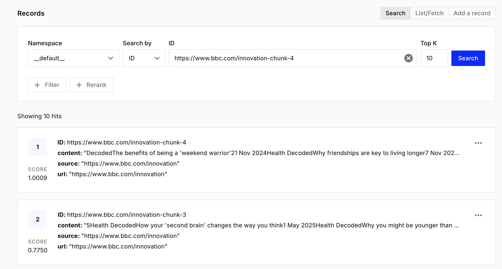

# Web Content RAG System with Gemini and Pinecone

A TypeScript-based Retrieval-Augmented Generation (RAG) system that scrapes web content, stores it in Pinecone vector database, and uses Google's Gemini AI to provide intelligent responses based on the scraped content.

## Screenshots

### Pinecone Console - Vector Search Results

*The Pinecone console showing stored content chunks with their similarity scores and metadata from scraped BBC Innovation pages.*

### System in Action - Terminal Output

*The RAG system processing URLs, storing content in Pinecone, and generating AI responses based on the retrieved context.*

## Features

- **Web Content Scraping**: Automatically extracts clean text content from web pages
- **Vector Storage**: Stores content embeddings in Pinecone for efficient similarity search
- **Content Chunking**: Intelligently splits large content into manageable chunks
- **Semantic Search**: Uses Gemini embeddings to find relevant content based on user queries
- **AI-Powered Responses**: Generates contextual answers using Gemini AI with retrieved content

## Prerequisites

- Node.js (v14 or higher)
- npm or yarn
- Google AI Studio API key
- Pinecone account and API key

## Installation

1. Clone the repository:
```bash
git clone https://github.com/yasithrashan/ts-gemini-pinecone-rag.git
```

2. Install dependencies:
```bash
npm install
```

3. Create a `.env` file in the root directory:
```env
GEMINI_API_KEY=your_gemini_api_key_here
PINECONE_API_KEY=your_pinecone_api_key_here
PINECONE_INDEX_NAME=your_pinecone_index_name_here
```

## Dependencies

```json
{
  "@google/generative-ai": "^0.x.x",
  "@pinecone-database/pinecone": "^1.x.x",
  "axios": "^1.x.x",
  "cheerio": "^1.x.x",
  "dotenv": "^16.x.x"
}
```

## Setup

### 1. Google AI Studio Setup
1. Visit [Google AI Studio](https://makersuite.google.com/app/apikey)
2. Create a new API key
3. Add it to your `.env` file as `GEMINI_API_KEY`

### 2. Pinecone Setup
1. Sign up at [Pinecone](https://www.pinecone.io/)
2. Create a new index with the following specifications:
   - **Dimensions**: 768 (for Gemini embedding-001 model)
   - **Metric**: cosine
   - **Cloud Provider**: Your preference
3. Get your API key from the Pinecone console
4. Add both `PINECONE_API_KEY` and `PINECONE_INDEX_NAME` to your `.env` file

## Usage

### Basic Usage

The application currently scrapes BBC Innovation pages and answers questions about innovations. To run:

```bash
npx tsx index.ts
```

### Customizing URLs

Modify the `urlsToScrape` array in the `main()` function:

```typescript
const urlsToScrape = [
    'https://example.com/page1',
    'https://example.com/page2',
    // Add more URLs as needed
];
```

### Customizing Queries

Change the `userQuery` variable in the `main()` function:

```typescript
const userQuery = 'Your question here';
```

## How It Works

1. **Content Scraping**: The system fetches web pages and extracts clean text content using Cheerio
2. **Content Chunking**: Large content is split into 800-character chunks for better processing
3. **Embedding Generation**: Each chunk is converted to vector embeddings using Gemini's embedding-001 model
4. **Vector Storage**: Embeddings are stored in Pinecone with metadata including source URL and original content
5. **Query Processing**: User queries are converted to embeddings and used to search for similar content
6. **Response Generation**: Retrieved content provides context for Gemini AI to generate informed responses

## Configuration Options

### Chunk Size
Modify the chunk size in the `chunkContent` function:
```typescript
const chunks = chunkContent(content, 1200); // Increase from default 800
```

### Content Limit
Adjust the scraped content limit in `scrapeContent`:
```typescript
return content.substring(0, 10000); // Increase from default 5000
```

### Search Results
Change the number of retrieved chunks:
```typescript
const queryResponse = await index.query({
    vector: embedding.embedding.values,
    topK: 10, // Increase from default 5
    includeMetadata: true,
});
```

## Error Handling

The application includes error handling for:
- Missing environment variables
- Web scraping failures
- Pinecone connection issues
- Embedding generation errors

## Limitations

- Content is limited to 5000 characters per page to manage token usage
- Currently processes URLs sequentially (not in parallel)
- No duplicate content detection
- Limited to publicly accessible web pages

## Contributing

1. Fork the repository
2. Create a feature branch (`git checkout -b feature/amazing-feature`)
3. Commit your changes (`git commit -m 'Add amazing feature'`)
4. Push to the branch (`git push origin feature/amazing-feature`)
5. Open a Pull Request

## License

This project is licensed under the MIT License - see the [LICENSE](LICENSE) file for details.

## Troubleshooting

### Common Issues

**"GEMINI_API_KEY is not set"**
- Ensure your `.env` file is in the root directory
- Check that the environment variable name matches exactly

**Pinecone connection errors**
- Verify your API key and index name
- Ensure your Pinecone index has 768 dimensions

**No content scraped**
- Check if the target website blocks automated requests
- Verify the URL is accessible and contains the expected content selectors

**Rate limiting**
- Add delays between requests if scraping multiple URLs
- Consider implementing exponential backoff for API calls
